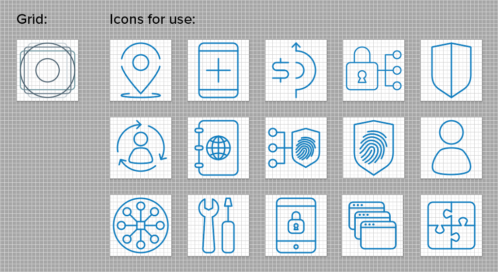
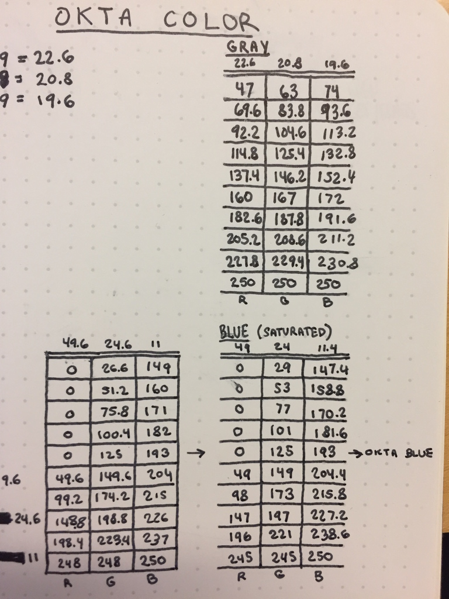
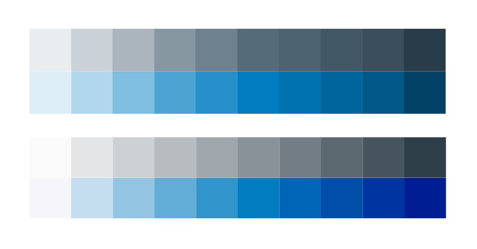
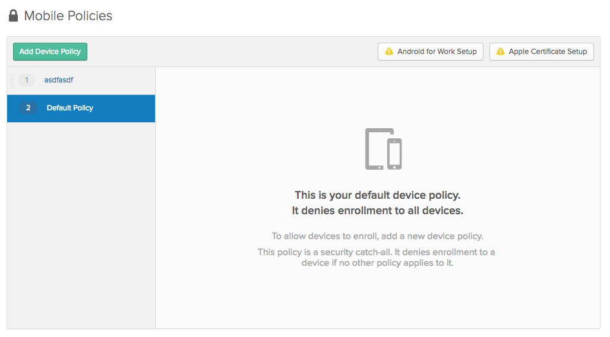
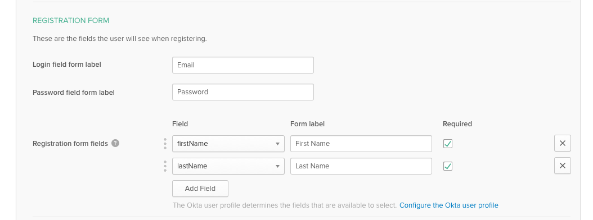
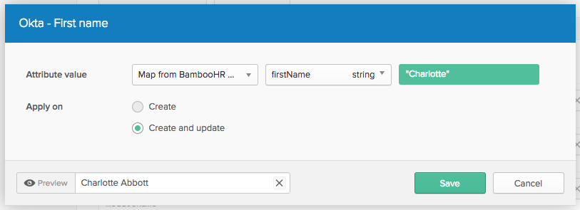

# Intentional

## Definition

* Done with care and attention to craft.
* Is deliberate. Understands the options and their pros/cons/risks and has chosen one.
* Takes a stance or voices an expert opinion to guide its audience.

## Examples

* Research
  * Our research is always goals-based. We research to validate assumptions and assess risks.
* Creative
  * Icon grid ensures that all icons, regardless of proportions, appear to be the same size.
	  
  * Color palette analysis is aimed at having consistently spaced values across a family of color.
	  
    
* Product
  * Policies have a zero state for your base policy to clearly explain what it does and why it's there. That way users don't have to try to parse it and guess about why it can't be removed.
	  
  * Registration separates credential fields from other fields. We think they should always be first, and we know that they have a different purpose from other fields you may want to use on a registration form.
    
  * Mappings force you to map one mapping at a time and automatically test for you. (This was done to reduce errors caused by mapping many attributes at once without testing.)
    

## When it applies

* Product
  * Selecting default settings
  * Deciding whether to make something configurable
  * Choosing how much to explain, how to frame a decision, what to recommend
  * Deciding which use cases to privilege
* Research
  * Deciding what questions to ask
  * Deciding whether to research something
  * Determining how to interpret findings, or what to do based on them (Is it okay that something was difficult?)
  * Discussing whether to give customers exactly what they've asked for
* Creative design
  * Considering a bold or striking design
  * Choosing a visual representation for a concept
  * Laying out a design
